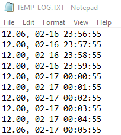

# sd-card-real-time-temp-logger
STM32 project that logs temperature and time into an SD card. Created to record the temperature of my room during power outages caused by snowstorms in Texas. Used an I2C serial 
RTC, I2C temperature sensor, and an SD card using SPI with [FatFs middleware].

## Temperature Logs

Above shows log file from my SD card that the microcontroller logged the temperature and time into. The first columns show the temperature in Celsius of my room and the second column shows the time in mm-dd hh:mm:ss format. The image includes the logs of the lowest temperatures that were logged in my room, which was about 12 degrees Celsius. The rest of the log file is in the sample directory. I could only record in short, intermitten periods because I did not have ample power supply.

## Data

Here is a sample of an I2C communication between the STM32 and the serial RTC collected from my logic analyzer:

Reading the data bits it says 0x02 and 0x15. Considering that we are reading from the month and then the date registers, we can say that it reads February 15th.

Sample of an I2C communication from the temperature sensor:

Reading the data bits, it says 0x11 for the MSB and 0x60 for the LSB. Translating that using this operation: (0x11 << 4 | 0x60 >> 4) * 0.0625 = 17.375 degrees Celsius.

## References

* SD card drivers for SPI: https://github.com/eziya/STM32_SPI_SDCARD
* FatFs middleware: http://elm-chan.org/fsw/ff/00index_e.html
* Temperature sensor datasheet: https://www.ti.com/lit/ds/symlink/tmp75b.pdf?ts=1613699957431&ref_url=https%253A%252F%252Fwww.google.com%252F
* RTC datasheet: https://datasheets.maximintegrated.com/en/ds/DS3231.pdf
